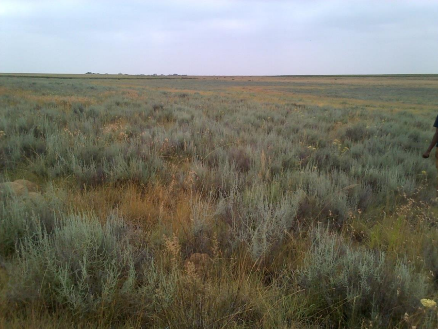
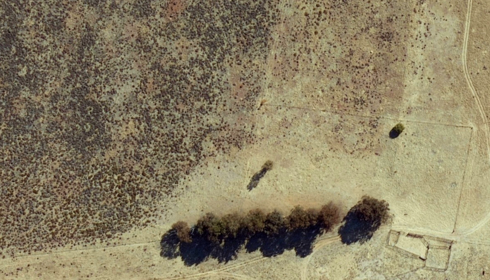

# Dry Ecosystems - Slangbos encroachment mapping in South Africa

### EO college repository regarding the analysis of bush encroachment pattern in the South African savanna.

Date: 04.01.2021

Content by Konstantin Schellenberg, published [Here (freely available)](https://www.mdpi.com/2072-4292/13/17/3342).

Data: Copernicus Sentinel Data (Sentinel-1 and Sentinel-2)

## Introduction

This tutorial aims to map the extent of Slangbos in highly dynamic open rangeland in vicinity to Thaba Nchu/Free State/SA by exploiting the dense ESA Copernicus Sentinel-1 (SAR, C-Band) and Sentinel-2 (multispectral) time series from 2015 to 2017.

By introducting the R-based machine learning (ML) framework mlr³ (Lang et al. 2019), the participant learns how the use the API to a variety of ML algorithms in the context of earth observation problems. The goals of this tutorial are:

1. Understand the problem of invasive species in savanna ecosystems
2. Get in touch with machine learning for Earth observation data
3. Understand the dimensionality of spatio-temporal data
4. Finally, conduct classification model for Slangbos encroachment mapping 

## Outline:

1. Slangbos encroachment problem
2. MLR3 framework presentation
3. Hands-on tutorial on using time series for mapping of invasive species

## 1. Slangbos encroachment problem

The endemic South African asteracea shrub *Seriphium plumosum L* (Slangbos) is increasingly invasive in grassvelds, with high dispersal rates in the provinces of Free State. Increasing woody cover and overgrazing in semi-arid ecosystems are known to be the major factors driving land degradation. Monitoring of the extent of shrubs are therefore essential for assessing landscape scale changes of the grassland biome and are key for management practises.

Avenant (2015)

NGI (2019)

## 2. MLR3 framework

Run example script from website

## References

(General)

- Lang, M.; Binder, M.; Richter, J.; Schratz, P.; Pfisterer, F.; Coors, S.; Au, Q.; Casalicchio, G.; Kotthoff, L. & Bischl, B. (2019). mlr3: A modern object-oriented machine learning framework in R . Journal of Open Source Software, DOI: 10.21105/joss.01903

(Slangbos Problem)

- Paul Avenant (2015): Report On The National Bankrupt Bush (Seriphium Plumosum) Survey (2010-2012). DOI: 10.13140/RG.2.2.27655.50088
- National Geo-spatial Information (NGI) (2019). Data Portal. Accessed (12.12.2019), http://www.cdngiportal.co.za/cdngiportal/

(MLR3 framework)

- Brenning, Alexander. 2012. “Spatial cross-validation and bootstrap for the assessment of prediction rules in remote sensing: The R package sperrorest.” In 2012 IEEE International Geoscience and Remote Sensing Symposium. IEEE. https://doi.org/10.1109/igarss.2012.6352393.
- Meyer, Hanna, Christoph Reudenbach, Tomislav Hengl, Marwan Katurji, and Thomas Nauss. 2018. “Improving Performance of Spatio-Temporal Machine Learning Models Using Forward Feature Selection and Target-Oriented Validation.” Environmental Modelling & Software 101 (March): 1–9. https://doi.org/10.1016/j.envsoft.2017.12.001.
- Valavi, Roozbeh, Jane Elith, Jose J. Lahoz-Monfort, and Gurutzeta Guillera-Arroita. 2018. “blockCV: an R package for generating spatially or environmentally separated folds for k-fold cross-validation of species distribution models.” bioRxiv, June. https://doi.org/10.1101/357798.
- Zhao, Ying, and George Karypis. 2002. “Evaluation of Hierarchical Clustering Algorithms for Document Datasets.” 11th Conference of Information and Knowledge Management (CIKM), 515–24. http://glaros.dtc.umn.edu/gkhome/node/167.

(Tutorial)

- Copernicus Sentinel-1 & 2 data (2019). processed by ESA.

