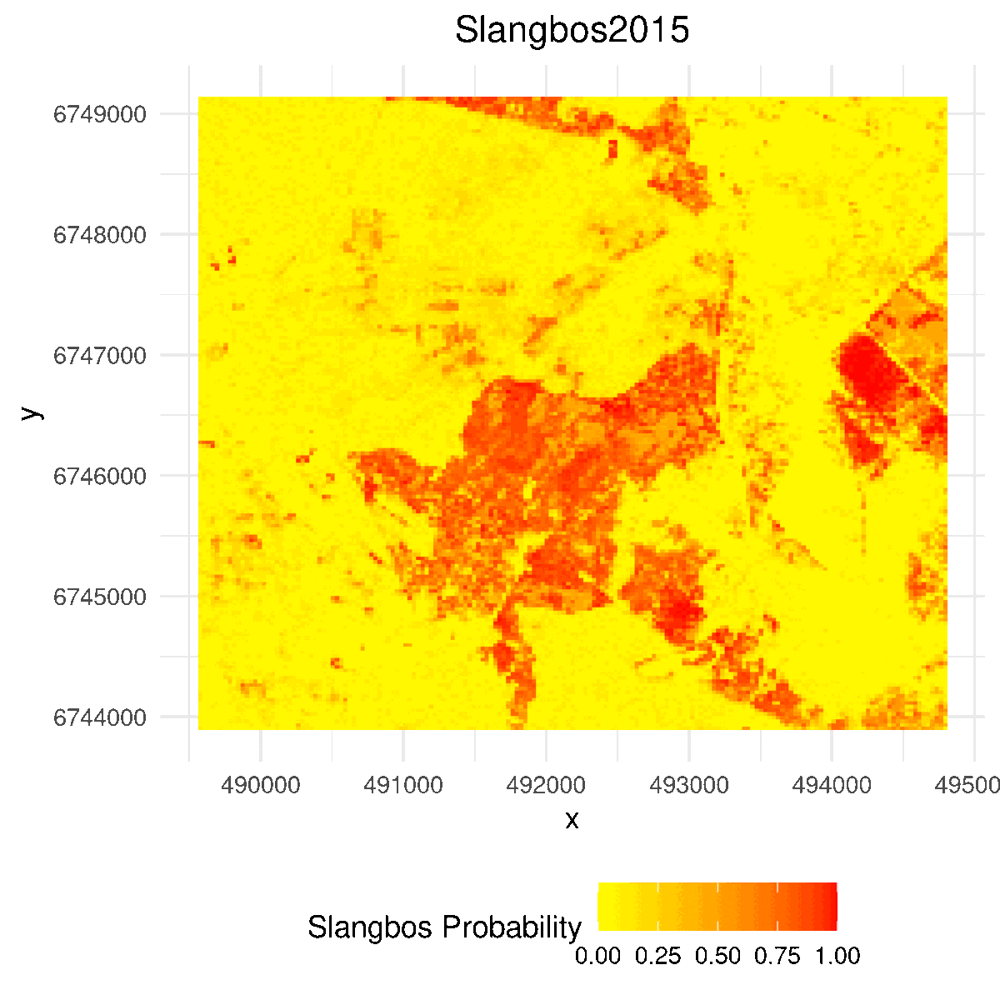
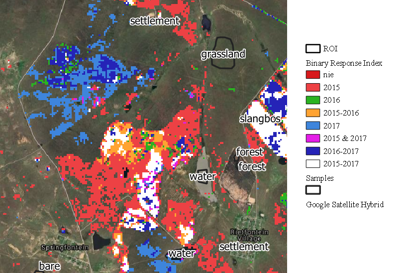

# Dry Ecosystems - Slangbos encroachment mapping in South Africa

### EO college repository regarding the analysis of bush encroachment pattern in the South African savanna.

Date: 04.01.2021

Content by Konstantin Schellenberg, published [Here (freely available)](https://www.mdpi.com/2072-4292/13/17/3342).

Data: Copernicus Sentinel Data (Sentinel-1 and Sentinel-2)

## TODO

- Slideshow smaller
- clean up 03
- clean up package import

## Introduction

This tutorial aims to map the extent of Slangbos in highly dynamic open rangeland in vicinity to Thaba Nchu/Free State/SA by exploiting the dense ESA Copernicus Sentinel-1 (SAR, C-Band) and Sentinel-2 (multispectral) time series from 2015 to 2017.

By introducting the R-based machine learning (ML) framework mlr³ (Lang et al. 2019), the participant learns how the use the API to a variety of ML algorithms in the context of earth observation problems. The goals of this tutorial are:

1. Understand the problem of invasive species in savanna ecosystems
2. Get in touch with machine learning for Earth observation data
3. Understand the dimensionality of spatio-temporal data
4. Finally, conduct classification model for Slangbos encroachment mapping 

## Outline:

1. Slangbos encroachment problem
2. MLR3 framework presentation
3. Hands-on tutorial on using time series for mapping of invasive species

## 1. Slangbos encroachment problem

The endemic South African asteracea shrub *Seriphium plumosum L* (Slangbos) is increasingly invasive in grassvelds, with high dispersal rates in the provinces of Free State. Increasing woody cover and overgrazing in semi-arid ecosystems are known to be the major factors driving land degradation. Monitoring of the extent of shrubs are therefore essential for assessing landscape scale changes of the grassland biome and are key for management practises.

[//]: # (image1)

    

(Avenant, 2015)

For the aerial perspective, shrubs clearly delineate from bare soil in the cold and dry winter months (Apr - September, left), while optical differences decrease in summer (October-March, right) 

[//]: # (image2)

    

(NGI, 2019)

___

Rapid land cover change dynamics, September acquisitons (2016-2021) (PlanetScope RGB greyscaled):

[//]: # (animation)

    

(Altered PlanetScope Data, Planet Team 2021-)

## 2. MLR3 framework

- Basic knowledge of statistical programming are useful
- Quick prototyping with one-liner code examples
- Successor of [mlr](https://mlr.mlr-org.com/), mlr³ CRAN release July 2019.
- [mlr3](https://mlr3.mlr-org.com/) repositorium
- Further reading, introduction and examples can be found in the [book project](https://mlr3book.mlr-org.com/introduction.html)

## 3. Hands-on Tutorial

Software prerequisites:
- R (4.1.2, released: 2021-11-01)
- IDE (e.g. R-Studio, PyCharm)
- QGIS (optional)
- R-packages: `tidyverse`, `raster`, `sf`, `mlr3`, `mlr3spatiotempcv`, `mlr3learners`, etc. The full dependencies are introduced in the coarse.

For participants not familiar with vectorisation in R we recommend taking courses on [R primers](hhttps://rstudio.cloud/learn/primers/), especially on [iteration](https://rstudio.cloud/learn/primers/5) with tidyverse.

There are several cheat-sheets out there. Check out with one on [mlr³](https://cheatsheets.mlr-org.com/mlr3.pdf).

Goal of the coarse is to map bush encroachment from supervised remote sensing data using open source software only.

The following animation is the final product of the coarse:

[//]: # (animation)

    

From the animation we can clearly see slangbos control happening in the southern part of the scene from 2015 to 2016. However, from 2016-2017 shrub sprawled quickly in the northwestern part, highlighting the very dynamic expansion of the species. 

[//]: # (animation)

    

## References

(General)

- Lang, M.; Binder, M.; Richter, J.; Schratz, P.; Pfisterer, F.; Coors, S.; Au, Q.; Casalicchio, G.; Kotthoff, L. & Bischl, B. (2019). mlr3: A modern object-oriented machine learning framework in R . Journal of Open Source Software, DOI: 10.21105/joss.01903

(Slangbos Problem)

- Paul Avenant (2015): Report On The National Bankrupt Bush (Seriphium Plumosum) Survey (2010-2012). DOI: 10.13140/RG.2.2.27655.50088
- National Geo-spatial Information (NGI) (2019). Data Portal. Accessed (12.12.2019), http://www.cdngiportal.co.za/cdngiportal/
- Planet Team (2021-). PlanetScope Data. Accessed via https://www.planet.com/. Student Quota.

(MLR3 framework)

- Brenning, Alexander. 2012. “Spatial cross-validation and bootstrap for the assessment of prediction rules in remote sensing: The R package sperrorest.” In 2012 IEEE International Geoscience and Remote Sensing Symposium. IEEE. https://doi.org/10.1109/igarss.2012.6352393.
- Meyer, Hanna, Christoph Reudenbach, Tomislav Hengl, Marwan Katurji, and Thomas Nauss. 2018. “Improving Performance of Spatio-Temporal Machine Learning Models Using Forward Feature Selection and Target-Oriented Validation.” Environmental Modelling & Software 101 (March): 1–9. https://doi.org/10.1016/j.envsoft.2017.12.001.
- Valavi, Roozbeh, Jane Elith, Jose J. Lahoz-Monfort, and Gurutzeta Guillera-Arroita. 2018. “blockCV: an R package for generating spatially or environmentally separated folds for k-fold cross-validation of species distribution models.” bioRxiv, June. https://doi.org/10.1101/357798.
- Zhao, Ying, and George Karypis. 2002. “Evaluation of Hierarchical Clustering Algorithms for Document Datasets.” 11th Conference of Information and Knowledge Management (CIKM), 515–24. http://glaros.dtc.umn.edu/gkhome/node/167.
- Muenchow, J., Brenning, A., Richter, M., (2012). Geomorphic process rates of landslides along a humidity gradient in the tropical Andes. Geomorphology, 139-140: 271-284

(Tutorial)

- Copernicus Sentinel-1 & 2 data (2019). processed by ESA.
- Hastie, T., R. Tibshirani und J. Friedman (2009). The Elements of Statistical Learning (2. Aufl.). New York: Springer.
- Brenning, Alexander. 2012. “Spatial cross-validation and bootstrap for the assessment of prediction rules in remote sensing: The R package sperrorest.” In 2012 IEEE International Geoscience and Remote Sensing Symposium. IEEE. https://doi.org/10.1109/igarss.2012.6352393.

